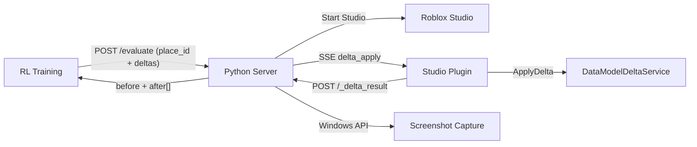

# Roblox RL Gym

A reinforcement learning environment for training models to edit Roblox experiences. The system receives delta strings from an external model, applies them to the DataModel via `DataModelDeltaService:ApplyDelta()`, and captures before/after screenshots for reward model training.

## Overview

Roblox RL Gym consists of three main components:

1. **Python Server**: A FastAPI-based server that manages Roblox Studio instances and coordinates delta application
2. **Roblox Studio Plugin**: A Luau plugin that runs inside Studio to apply deltas and report results
3. **Screenshot Capture**: Windows API-based screen capture for observing the experience state

The system uses Server-Sent Events (SSE) for real-time communication between the server and plugin.

## Features

- **Delta Evaluation**: Evaluate multiple deltas against a Roblox place (by ID) with before/after screenshots
- **Screenshot Capture**: Capture the Studio viewport state for reward model training
- **Configurable Output**: PNG or JPEG format with adjustable quality
- **Real-time Communication**: SSE-based architecture for instant feedback
- **Automatic Setup**: Server handles plugin installation and Studio configuration
- **Secure Authentication**: Dual authentication system for remote workers and plugin
- **Rate Limiting**: Configurable request limits per minute

## Architecture



## Security & Authentication

Roblox RL Gym uses a dual authentication system:

1. **API Keys** for remote workers to access the `/evaluate` endpoint
2. **Session Tokens** for the plugin to access internal endpoints (`/_events`, `/_delta_result`)

See [AUTHENTICATION.md](AUTHENTICATION.md) for detailed setup instructions.

## Installation

### Prerequisites

- Python 3.11+
- Roblox Studio
- [Rojo](https://rojo.space/) (for building Roblox files)
- [UV](https://github.com/astral-sh/uv) (Python package manager)

### Setup

1. **Clone the repository**:

   ```bash
   git clone <repository-url>
   cd JestLuaTestServer
   ```

2. **Install Python dependencies**:

   ```bash
   pip install uv
   cd server
   uv pip install -e .
   ```

3. **Install Roblox tooling** (if not already installed):

   Install Rokit first: https://github.com/rojo-rbx/rokit?tab=readme-ov-file#installation

   ```bash
   # Install required tools
   rokit install
   ```

## Usage

### Starting the Server

First, set your Roblox user ID (required for Studio authentication):

```bash
export ROBLOX_RL_GYM_USER_ID=your_roblox_user_id
```

Then start the server:

```bash
cd server
uv run python run.py
```

The server will:

1. Configure required Studio FFlags
2. Install the Roblox Studio plugin with session token
3. Load API keys from `api_keys.txt` (if authentication is enabled)
4. Listen for requests on the configured port

### Setting Up Authentication

1. Create `server/api_keys.txt` file with your API keys (one per line):

   ```
   worker1_key_abc123xyz789
   worker2_key_def456uvw012
   ```

2. Generate secure API keys:
   ```bash
   python -c "import secrets; print(secrets.token_urlsafe(32))"
   ```

### Evaluating Deltas

Submit a place ID, universe ID, and list of deltas to evaluate:

```python
import httpx

# Roblox place/universe IDs (must be accessible by the configured user)
PLACE_ID = 91687916122639
UNIVERSE_ID = 7061934907

deltas = [
    "delta-string-1",
    "delta-string-2",
    "delta-string-3",
]

response = httpx.post(
    "http://localhost:8325/evaluate",
    json={
        "place_id": PLACE_ID,
        "universe_id": UNIVERSE_ID,
        "deltas": deltas,
    },
    headers={"X-API-Key": "your-api-key-here"},
    timeout=120.0,  # Long timeout since Studio needs to launch
)

result = response.json()
print(f"Success: {result['success']}")
print(f"Before screenshot: {result['before_screenshot'][:50]}...")

for delta_result in result['results']:
    print(f"Delta {delta_result['delta_index']}: {delta_result['success']}")
    if delta_result['after_screenshot']:
        print(f"  After screenshot: {delta_result['after_screenshot'][:50]}...")
```

## API Reference

### Endpoints

#### `POST /evaluate`

Evaluate a list of deltas against a Roblox place. Captures a single "before" screenshot (baseline) and an "after" screenshot for each delta. The place is opened in Studio using the provided IDs.

**Request (JSON):**

```json
{
  "place_id": 91687916122639,
  "universe_id": 7061934907,
  "deltas": ["delta-string-1", "delta-string-2"]
}
```

**Headers:**

- `Content-Type: application/json`
- `X-API-Key: your-api-key` (required if authentication is enabled)

**Response:**

```json
{
  "request_id": "uuid-string",
  "success": true,
  "error": null,
  "before_screenshot": "base64-encoded-image...",
  "results": [
    {
      "delta_index": 0,
      "success": true,
      "error": null,
      "after_screenshot": "base64-encoded-image..."
    },
    {
      "delta_index": 1,
      "success": false,
      "error": "Delta application failed: ...",
      "after_screenshot": null
    }
  ],
  "timestamp": "2025-12-16T..."
}
```

#### `GET /health`

Check server status.

**Response (no active evaluation):**

```json
{
  "status": "healthy",
  "studio_active": false
}
```

**Response (during evaluation):**

```json
{
  "status": "healthy",
  "studio_active": true,
  ...
}
```

The `status` field will be `"degraded"` if any health checks fail during an active evaluation.

#### `GET /_events` (Internal)

Server-Sent Events endpoint for plugin communication.

#### `POST /_delta_result` (Internal)

Endpoint for plugin to submit delta application results.

#### `POST /_undo_complete` (Internal)

Endpoint for plugin to signal that a delta has been undone.

#### `POST /_heartbeat` (Internal)

Endpoint for plugin to send heartbeat signals.

## Configuration

### Environment Variables

All environment variables should be prefixed with `ROBLOX_RL_GYM_`:

| Variable                  | Default       | Description                                                            |
| ------------------------- | ------------- | ---------------------------------------------------------------------- |
| `USER_ID`                 | _required_    | Roblox user ID for Studio authentication                               |
| `HOST`                    | `127.0.0.1`   | Server bind address                                                    |
| `PORT`                    | `8325`        | Server port                                                            |
| `ENV`                     | `development` | Environment: `development`, `production`, or `test`                    |
| `STEP_TIMEOUT`            | `30`          | Delta application timeout (seconds)                                    |
| `RESET_TIMEOUT`           | `30`          | Reset operation timeout (seconds)                                      |
| `SHUTDOWN_TIMEOUT`        | `30`          | Graceful shutdown timeout (seconds)                                    |
| `LOG_LEVEL`               | `INFO`        | Logging level                                                          |
| `ENABLE_AUTH`             | `true`        | Enable authentication                                                  |
| `MAX_REQUESTS_PER_MINUTE` | `500`         | Rate limit for API requests                                            |
| `MAX_RBXM_SIZE`           | `52428800`    | Maximum RBXM file size (50MB)                                          |
| `CORS_ORIGINS`            | `["*"]`       | Allowed CORS origins                                                   |
| `SCREENSHOT_WIDTH`        | _none_        | Output screenshot width (optional, preserves aspect ratio if omitted)  |
| `SCREENSHOT_HEIGHT`       | _none_        | Output screenshot height (optional, preserves aspect ratio if omitted) |
| `SCREENSHOT_FORMAT`       | `png`         | Image format: `png` or `jpeg`                                          |
| `SCREENSHOT_JPEG_QUALITY` | `85`          | JPEG quality (1-100)                                                   |
| `SCREENSHOT_CROP_LEFT`    | `0.125`       | Viewport crop from left                                                |
| `SCREENSHOT_CROP_RIGHT`   | `0.0`         | Viewport crop from right                                               |
| `SCREENSHOT_CROP_TOP`     | `0.143`       | Viewport crop from top                                                 |
| `SCREENSHOT_CROP_BOTTOM`  | `0.055`       | Viewport crop from bottom                                              |

You can also create a `.env` file in the `server/` directory instead of setting environment variables.

## Project Structure

```
JestLuaTestServer/
├── server/                         # Python server application
│   ├── app/
│   │   ├── main.py                 # FastAPI application
│   │   ├── config_manager.py       # Configuration settings
│   │   ├── dependencies.py         # Dependency injection
│   │   ├── auth.py                 # Authentication middleware
│   │   ├── api_keys.py             # API key management
│   │   ├── endpoints/              # API endpoints
│   │   │   ├── evaluate.py         # /evaluate endpoint
│   │   │   ├── events.py           # SSE events for plugin
│   │   │   └── delta_results.py    # Plugin result reporting
│   │   └── utils/                  # Utility modules
│   │       ├── screenshot_capture.py  # Windows screenshot capture
│   │       ├── plugin_manager.py   # Plugin management
│   │       ├── fflag_manager.py    # FFlag management
│   │       └── studio_manager.py   # Studio management
│   ├── api_keys.txt                # API keys file (gitignored)
│   ├── api_keys.txt.example        # Example API keys file
│   ├── pyproject.toml              # Python project configuration
│   └── run.py                      # Server entry point
├── plugin/                         # Roblox Studio plugin
│   ├── src/
│   │   ├── Main.server.lua         # Plugin entry point
│   │   └── DeltaManager/           # Delta application module
│   │       ├── init.lua            # Main delta manager
│   │       ├── Logger.lua          # Logging utility
│   │       └── DataModelDeltaService.mock.luau  # Mock for testing
│   └── default.project.json        # Rojo project configuration
├── AUTHENTICATION.md               # Authentication documentation
├── rokit.toml                      # Roblox toolchain configuration
└── selene.toml                     # Luau linter configuration
```

## License

This project is licensed under the Apache License 2.0. See the LICENSE file for details.

## Contributing

Contributions are welcome! Please feel free to submit issues and pull requests.
